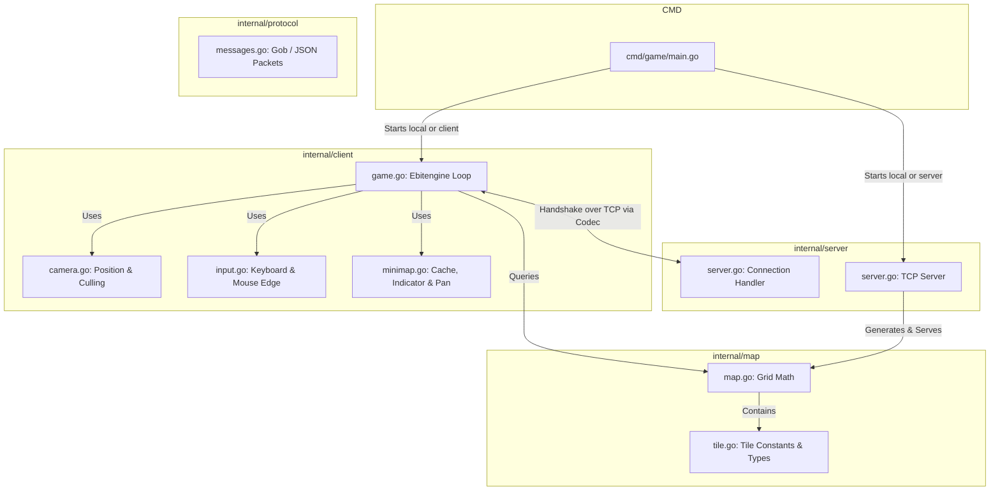
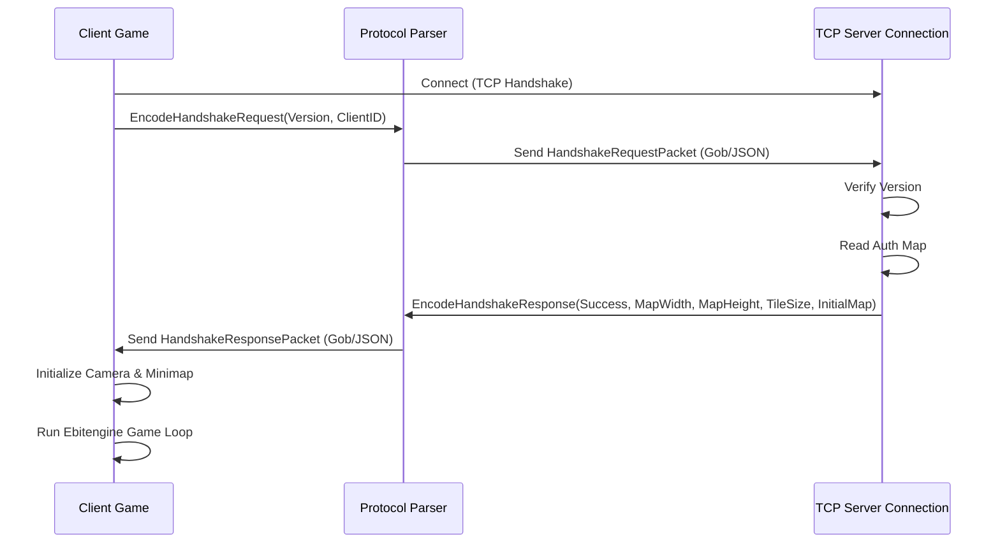

# Architecture Overview

This document provides a high-level overview of the system's components, boundaries, and runtime architecture.

## System Components

### 1. Command-Line Entry (`cmd/game/`)
- **`main.go`**: Parses runtime arguments (`--mode`, `--addr`, `--proto`). Orchestrates bootup:
  - **`server`**: Spins up the TCP Server synchronously and listens for incoming connections.
  - **`client`**: Handshakes with the remote server, queries map data, and boots the Ebitengine UI.
  - **`local`**: Boots the TCP Server in a background goroutine and connects local loopback client in the foreground.

### 2. The Client (`internal/client/`)
- **`game.go`**: Orchestrates `Update()`, `Draw()`, and `Layout()` loops for Ebitengine. Maintains the active viewport camera and local world state.
- **`camera.go`**: Encapsulates 2D viewport coordinates, viewport culling calculations, world-to-screen coordinate translations, and viewport clamping.
- **`input.go`**: Reads hardware inputs for mouse position and arrow keys.
- **`minimap.go`**: Draws a scaled-down 256x256 HUD overlay in the bottom-left corner. Manages a pre-rendered background buffer, draws the camera viewport indicator box, and transforms minimap coordinate clicks/drags into world coordinate camera repositioning.

### 3. The Server (`internal/server/`)
- **`server.go`**: Simple concurrent TCP server. For each client connection, it spawns a goroutine to perform the handshake exchange, sending over the complete `internal/map` data.

### 4. Protocol and Core (`internal/protocol/`, `internal/map/`)
- **`protocol/messages.go`**: Decouples network serialization logic (JSON and Gob) from the application. Defines standard handshake packets.
- **`map/map.go` & `tile.go`**: Represent standard tile grid properties, layout dimensions, and tile variety types.

---

## Network Handshake Sequence

